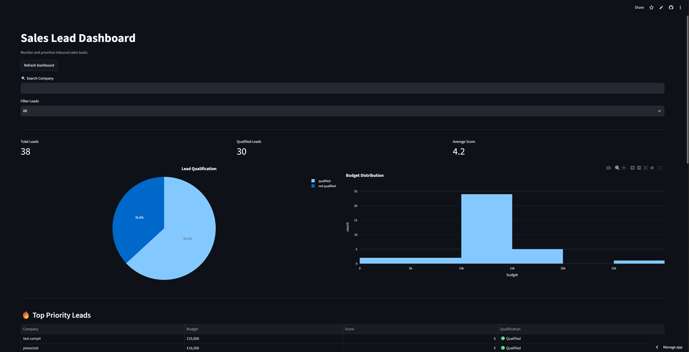
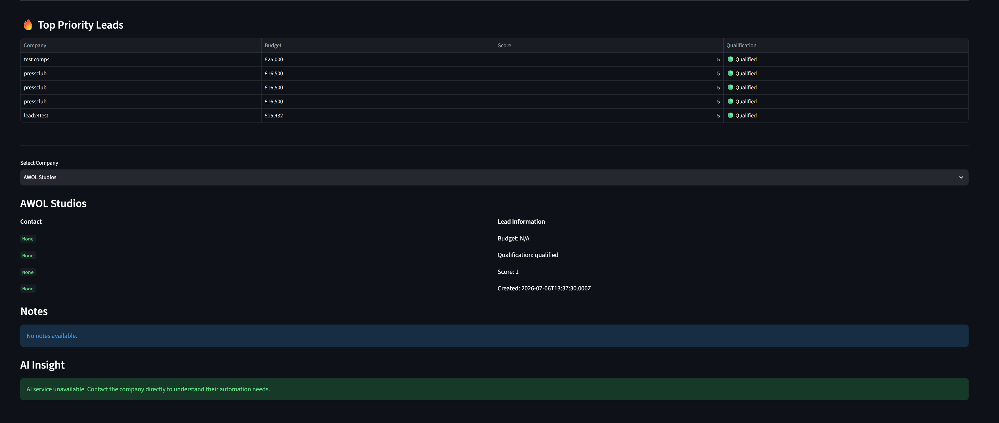
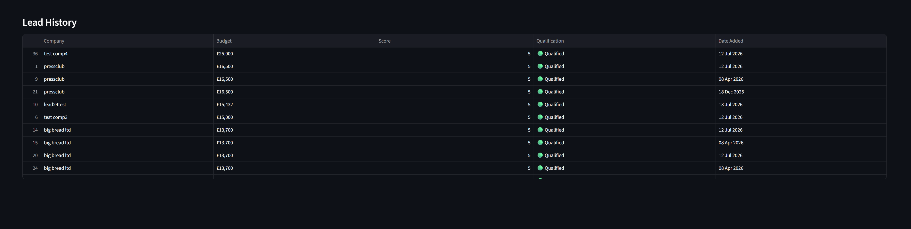

#  Sales Lead Dashboard

An AI-powered sales dashboard that visualises, filters and prioritises inbound sales leads in real time.

The dashboard is powered by a Flask REST API, Airtable and Make.com automations, providing sales teams with an easy way to monitor qualified leads, review AI-generated insights and track key sales metrics.

---

##  Live Demo

**Dashboard:** (https://lead-dashboard-nnn5fenapaxuwrhdxrkiao.streamlit.app/)

**API:** (https://lead-qualifier-api-1.onrender.com)

---

##  Dashboard Preview

### Dashboard Overview



### Lead Details



### Lead History



---

##  Features

- AI-powered lead qualification
- Live sales dashboard
- Interactive charts and analytics
- Search companies
- Filter qualified and non-qualified leads
- Priority lead identification
- Lead details viewer
- Airtable integration
- REST API integration
- CSV export
- Responsive dashboard built with Streamlit

---

##  Tech Stack

### Backend

- Python
- Flask REST API

### Frontend

- Streamlit
- Plotly
- Pandas

### Database

- Airtable

### Automation

- Make.com

### Deployment

- Render
- Streamlit Community Cloud

---

##  System Architecture

```text
Tally Form
      │
      ▼
 Airtable Database
      │
      ▼
 Make.com Automation
      │
      ▼
 Flask REST API
      │
      ▼
 AI Lead Qualification
      │
      ▼
 Airtable Update
      │
      ▼
 Streamlit Dashboard
```

---

##  Dashboard Metrics

The dashboard automatically calculates:

- Total Leads
- Qualified Leads
- Average Lead Score
- Qualification Rate
- Lead Priority Ranking

---

##  Project Structure

```text
lead-dashboard/
│
├── assets/
├── components/
├── services/
├── app.py
├── requirements.txt
└── README.md
```

---

## ⚙ Installation

Clone the repository

```bash
git clone https://github.com/vck100/lead-dashboard.git
```

Install dependencies

```bash
pip install -r requirements.txt
```

Run the dashboard

```bash
streamlit run app.py
```

---

##  Future Improvements

- User authentication
- Automatic dashboard refresh
- Email notifications
- Advanced analytics
- CRM integration
- Role-based access
- Forecasting dashboard
- Dark mode
- Mobile optimisation

---

##  Author

Developed by **Victor Ola**

GitHub:
https://github.com/vck100